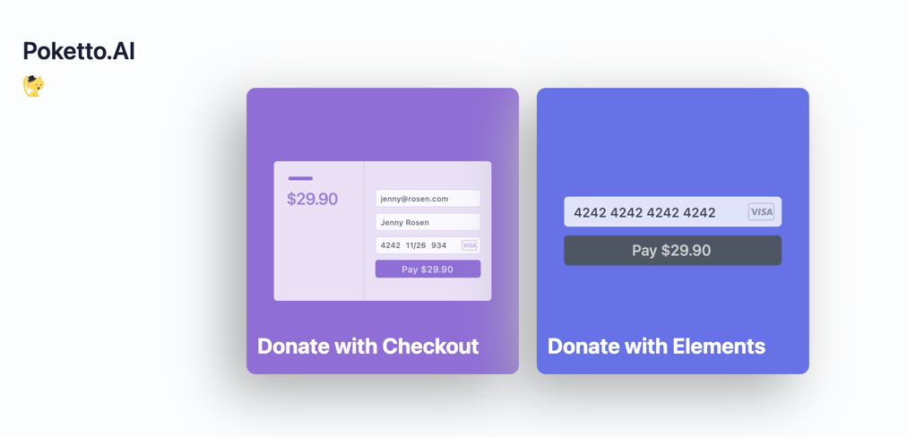
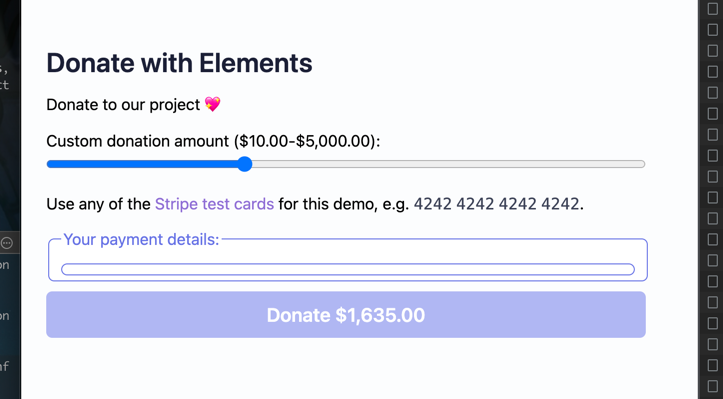

## stripe

- references:
    - node sdk: https://github.com/stripe/stripe-node#configuration
    - esm: https://stripe.com/docs/libraries/stripejs-esmodule
    - react: https://stripe.com/docs/stripe-js/react
    - api keys: https://dashboard.stripe.com/apikeys
    - products dashboard: https://dashboard.stripe.com/pricing-tables/prctbl_1NcBRrHb6cJdkB4pyeFBevTI
    - embedding pricing table doc: https://stripe.com/docs/payments/checkout/pricing-table

- examples:
    - (recommend) checkout example: https://vercel.com/guides/getting-started-with-nextjs-typescript-stripe
    - (recommend) nextjs official checkout
      example: https://github.com/vercel/next.js/tree/canary/examples/with-stripe-typescript
    - taxonomy stripe example: https://github.com/cs-magic/taxonomy/blob/main/app/api/users/stripe/route.ts
    - nextjs prisma stripe: https://github.com/BastidaNicolas/nextauth-prisma-stripe
    -

- pricing table (embedded)
    - 重点参考里面的 react 环节，以及小心 typescript
      部分的声明： https://stripe.com/docs/payments/checkout/pricing-table#embed
    -

- 捐款 demo （nextjs + Element): https://github.com/vercel/next.js/tree/canary/examples/with-stripe-typescript
    - 
    - 但是里面的 `Element` 总是出不来：
        - 

## next-auth

### bug: server-error

这个问题，主要是因为没有配置 `next-auth` 的秘钥，但又用了 middleware。

参考：

- https://next-auth.js.org/configuration/nextjs#prerequisites
- https://stackoverflow.com/a/71093567/9422455

## UI / tailwind

- 子元素
    - https://stackoverflow.com/questions/67119992/how-to-access-all-the-direct-children-of-a-div-in-tailwindcss
- 分组
    - 结论：确实用括号后代码的可扩展性比较差，但是直接写也不太方便，感觉最好直接用 `@apply` 定义自己的原子组件，现阶段先能少用插件就少用插件！
    - 参考
        - 【必看】Grouping variants together · tailwindlabs/tailwindcss · Discussion
          #8337, https://github.com/tailwindlabs/tailwindcss/discussions/8337
        - milamer/tailwind-group-variant: Group multiple tailwind classes into a single
          variant, https://github.com/milamer/tailwind-group-variant
        - 