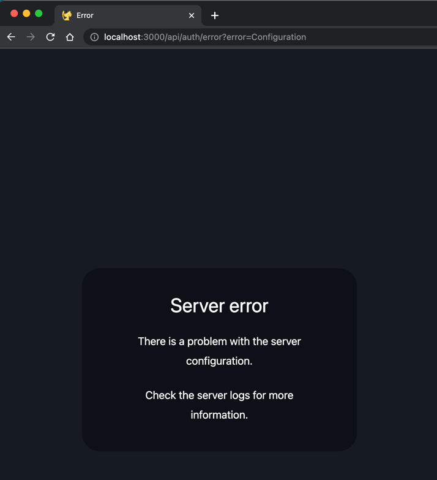

## next-auth

### bug: server-error

这个问题，主要是因为没有配置 `next-auth` 的秘钥，但又用了 middleware。

参考：

- https://next-auth.js.org/configuration/nextjs#prerequisites
- https://stackoverflow.com/a/71093567/9422455

## UI / tailwind

- 子元素
    - https://stackoverflow.com/questions/67119992/how-to-access-all-the-direct-children-of-a-div-in-tailwindcss
- 分组
    - 结论：确实用括号后代码的可扩展性比较差，但是直接写也不太方便，感觉最好直接用 `@apply` 定义自己的原子组件，现阶段先能少用插件就少用插件！
    - 参考
        - 【必看】Grouping variants together · tailwindlabs/tailwindcss · Discussion
          #8337, https://github.com/tailwindlabs/tailwindcss/discussions/8337
        - milamer/tailwind-group-variant: Group multiple tailwind classes into a single
          variant, https://github.com/milamer/tailwind-group-variant
        - 